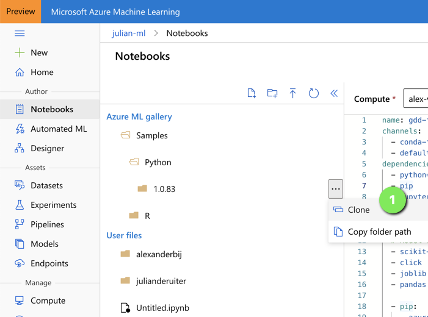

# code-breakfast-azure-ml
Material for the AzureML code breakfast.

### Follow the step-by-step notebooks

For a simple clear step-by-step guides. If you want to skip this feel free to follow some examples.

### How-to-use-AzureML

In this directory there are plenty of examples in this code breakfast we want to focus on how-to-use-azure-ml.

Some good starting point:
- `how-to-use-azureml/training/train-within-notebook`

### Challenges

Pick and choose your battles:

- Upload a File and register as a Tabular DataSet
- Connect second StorageAccount (gen2) as a DataStore 
- Connect a SqlDatabase as a DataStore
- Register a SkLearn Model (after fit) 
- Deploy titanic model in Azure Container)
- Create a new Version of a DataSet with more records
- Change a DataSert and use the data drift detection
- Use Databricks as a compute target for a large datasets
- Monitor: Collect metrics from a running model 
- Integrate Azure DevOps for deploying new models (CD) 